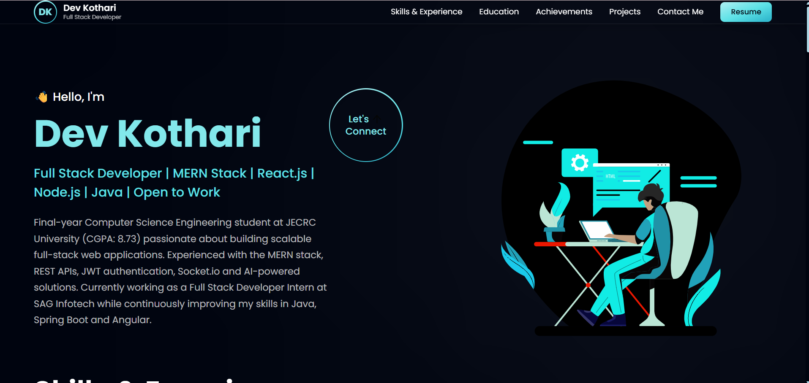

<h1 align="center">🚀 Dev Kothari - Personal Portfolio</h1>

<p align="center">
A modern, responsive developer portfolio built using React and Vite to showcase my projects, skills, experience, and achievements.
</p>

<p align="center">
<a href="https://personal-portfolio-lake-kappa-91.vercel.app/">🌐 Live Portfolio</a> •
<a href="https://github.com/devkothari040306">GitHub</a> •
<a href="https://www.linkedin.com/in/dev040306">LinkedIn</a>
</p>

---

## 📸 Portfolio Preview

> Replace this image with a screenshot of your portfolio.



---

# 📑 Table of Contents

- About
- Tech Stack
- Features
- Projects
- Installation
- Folder Structure
- Deployment
- Contact
- License

---

# 👨‍💻 About

Hi, I'm **Dev Kothari**, a Final-Year Computer Science Engineering student at **JECRC University**.

I'm passionate about building scalable Full Stack Web Applications using the MERN Stack and continuously learning modern technologies including Java, Spring Boot, and Angular.

This portfolio showcases my projects, internship experience, technical skills, and achievements.

---

# 🛠 Tech Stack

### Frontend

- React.js
- Vite
- Tailwind CSS
- JavaScript (ES6)
- HTML5
- CSS3

### Backend

- Node.js
- Express.js
- REST APIs
- JWT Authentication
- Socket.io

### Database

- MongoDB
- MongoDB Atlas
- MySQL

### Tools

- Git
- GitHub
- Postman
- Cloudinary
- Vercel
- Render

---

# ✨ Features

- Responsive Design
- Modern UI
- Smooth Animations
- Skills Timeline
- Education Section
- Internship Experience
- Project Showcase
- Social Links
- Resume Download
- Contact Section

---

# 🚀 Featured Projects

## 👕 TryOnix

AI-powered Outfit Recommendation Platform

### Features

- Virtual Try-On
- AI Chatbot
- JWT Authentication
- Outfit Recommendation
- MERN Stack
- Cloudinary Integration

Live Demo

https://try-onix-six.vercel.app/

GitHub

https://github.com/devkothari040306/TryOnix

---

## 💇 Spotlight Salon

Salon Appointment Booking System

### Features

- MERN Stack
- Authentication
- Admin Dashboard
- Appointment Booking
- CRUD Operations

Live Demo

https://spotlight-indol-mu.vercel.app/

GitHub

https://github.com/devkothari040306/Spotlight-Salon-Appointment-App

---

## 💬 MERN Chat App

Real-Time Chat Application

### Features

- Socket.io
- JWT Authentication
- Real-time Messaging
- Image Sharing
- Password Reset

Live Demo

https://chat-app-2fpa.vercel.app/

GitHub

https://github.com/devkothari040306/mern-chat-app

---

# ⚙ Installation

Clone the repository

```bash
git clone https://github.com/devkothari040306/personal-portfolio.git
```

Go to project folder

```bash
cd personal-portfolio
```

Install dependencies

```bash
npm install
```

Start development server

```bash
npm run dev
```

Build project

```bash
npm run build
```

Preview production build

```bash
npm run preview
```

---

# 📁 Folder Structure

```
src
 ├── assets
 ├── components
 ├── constants
 ├── pages
 ├── App.jsx
 └── main.jsx
```

---

# 🚀 Deployment

This portfolio is deployed on **Vercel**.

To deploy your own version:

```bash
npm run build
```

Upload the generated `dist` folder or connect the repository directly with Vercel.

---

# 📫 Contact

**Dev Kothari**

📧 Email: devkothari040306@gmail.com

🌐 Portfolio

https://glow-folio-07.lovable.app

💼 LinkedIn

https://www.linkedin.com/in/dev040306

💻 GitHub

https://github.com/devkothari040306

---

# ⭐ Support

If you like this project, consider giving it a ⭐ on GitHub.

It really helps and motivates me to build more projects.

---

# 📄 License

This project is open-source and available under the MIT License.
